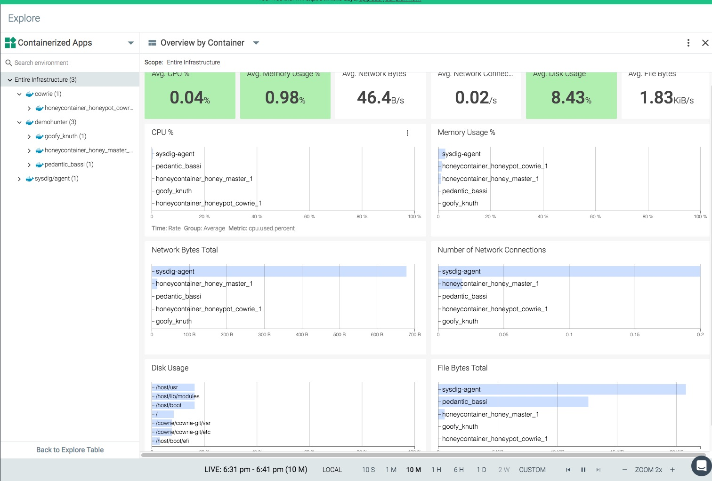

 # Implementación de Honeypot para Investigadores y Usuarios

Alumno: Felipe Villalobos
Profesor: Jose Rodríguez

Proyecto de implementación de Honeypots de forma simple, tanto para investigadores como individuos que desean agregar una capas mas de seguridad, sin la necesidad de tener conocimiientos específicos técnicos de un especialista de seguridad de la información o un técnico de sistemas.


## Estado del Arte

Honeypot es un programa o sistema, diseñado especialmente para capturar los acceso no deseados. La funcion de estos programas o sistemas, es que sean explotados, con el fín de capturar los archivos y las acciones que un bot, malware o persona efectuen.

Estos se pueden clasificar en 2 grupos con criterios diferentes:

En el primer grupo, se identifican los actores que desean utilizar un honeypot. En este tenemos 2 clasificaciones:

* Personas o instituciones que desean realizar investigaciónes con los resultados obtenidos.
* Personas o instituciones que desean implementar una capa de seguridad en sus sistemas.

El segundo grupo, clasifíca los honeypots respecto a su diseño y funcionalidad:

* Interacción Alta: Por lo general son sitemas donde el atacante puede usar multiples recursos y el servicio. Estos no son emulados.
* Interacción Baja: Son sistemas o servicios emulados, donde el atacante tiene una limitación de lo que puede hacer. Por lo general, estos son utilizados para capturar malware provenientes de bots.


### HoneyPots
#### Thug
Este es un honeypot de interacción baja, con un tipo híbrido de análisis, estático y dinámico. Permite analizar los shellcode descargados en páginas web mediante javascript.

Si bien tiene una lista de requerimientos alta, la documentación indica que se puede implementar con un commando ``pip install``

Una forma mas simple, es instalarlo mediante docker:
``docker run -it -v ~/logs:/logs honeynet/thug``

#### Cowrie
Este honeypot es uno de los de preferidos. Es utilizados tanto por investigaodres como usuarios que desean aumentar su nivel de seguridad en su red.

Su principal foco es la implementación de un honeypot con protocolos SSH y Telnet, pero ahora ya soporta otros comandos como SCP, sleep y users,  entre varios más. También tiene soporte básico para el protocolo SFTP.

Incluye ejemplos de configuración para conectar los logs a Logstah y Kibana.

Se puede implementar en forma manual o mendiante docker: *https://github.com/cowrie/docker-cowrie*. Este tiene una configuración realizada con docker-compose que permite la implementación del servicio con un solo comando: ``docker-compose up``.

#### Dionaea
Es un honeypot que fue pensado en ser un predecesor del honeypot nepenthes(Planta Carnivora). La lista de protocolos que soporta es extensa *blackhole, epmap, ftp, http, memcache ,mirror, mqtt, mssql, mysql, pptp, sip, smb, tftp, upnp*. Esta desarrollado en base python y una de las características que lo destaca es que ahora soporta IPV6.

La funcionalidad de este honeypot es la de atrapar malware para poder analisarlo posteriormente, tal cual lo hacía nepenthes.

Algunas de sus funciones son:

* Soporta modulos: curl, emu, pcap, python
* Aplicacioens genreales de log: debug, info, warning, error, critical
* Puede ser integrado con DionaeaFR, que es un visualizador frontend para ver los ataques
* Se puede integrar con ELK para visualizar la informacion de los ataques
* Emulación de servicios y confiuración de los mismos.

Podriamos decir que es uno de los honeypots mas completos en cuanto al tipo de protocolos que puede levantar.

#### Pewpew
Pewpew, si bien no es un honeypot en si, es una herramienta visual que permite ver los ataque en tiempo real en un mapa. Tal cual lo hace *FireEye Cyber Threat map}

#### Kippo
Es un Honeypot espesífico para el servicio SSH. Permite hacer un log de ataque de fuerza bruta y revisar las interacciones completa de la shell del atacante.

#### DemoHunter
Es un honeypot de interacción baja, que tiene la posibildiad de desplegar un maestro y los agentes que se deseen. Dentro de los protocolos que puede simular son: http, telnet y VNC.
Su desarrollo esta realizado completamente en python.

De los honeypots comentados se seleccionan 2 para la implementación. Cowrie y Demohunter.
Cowrie para probar el despliegue rapido de un honeypot conocido y Demohunter con la finalidad de probara el deslpiegue rapdio de un Master/Agente, que si bien, no tiene tantas funcionalidades como otros honeypots mencionados, es una muy buena base para comezar.

## Motivación

En mis comienzos con el mundo del internet, donde solo existía un modem 56k para comunicarnos con el mundo exterior, el internet no era tan amplio y abundante como lo es hoy. Ahora podemos encontrar los cosas menos esperadas conecatdas a internet transmitiendo distintos tipos de datos. Y no solo a travez de internet, si no que tambien a travez de señales radiales estándares como propias (zigbee), donde distintos equipos pueden tener una red cerrada para comunmicarse.

La curiosidad de querer entender como funcionan las cosas, me ha llevado a investigar y revisar como y a travéz de qué, es posible que equipos, que antes eran "*tontos*" ahora son dispositivos "inteligentes" que nos ayudan a determinar:

* Nuestro comportamiento
* Que es lo que nos gusta
* Por donde nos movilizamos
* Que partes del mundo hemos visitado
* Cuále es nuestro lugar de trabajo
* Si estamos de vacaciones
* Cuáles son nuestros circulos sociales
* Si hacemos ejercicio
* Que cosas nos gustan

Todo esto y muchos otros datos son capturados en la mayoría por dispositivos IoT y transmitidos de alguna forma a la "*nube}" con que la mayoría de los usuarios se percaten de esto o entiendan que es lo que esto significa. Es por eso que la EU saco la regulación GDPR, pero eso es otra historia.

Si bien tengo el conocimiento de entender como se conectan, la curiosidad de saber cual es el volumen de información que es transmitida, que tipo de información intercambian, entender que pueden ser usados no solo para felicitar nuestras vidas, sino que para obtener información confidencia de los usuarios sin que estos lo sepan. Todo esto, que a algunas personas las lleva un poco a la paranoia, es lo que a mi me llama a investigar y entender. Mi naturaleza no me deja permitir que algo me controle, solo porque no lo entiendo.

Los avances en los dispositivos IoT, que han ido creciendo en forma abismaste, han llevado a que basarse en la confianza en la ignorancia de le gente para implementar una capa de seguridad, ya es insuficiente.

Hoy en día el internet esta abierto y disponible para muchos en el mundo y la información se  encuentra ahí, solo basta con encontrarla. En caso de que esta información no exista, alguien que tiene el conocimiento eventualmente lo compartirá en internet con el resto, la probabilidad hoy en día es muy alta como para seguir haciendo las mismas practicas de confianza de antes.

Todos este *boom* de la información, a llevado a requerir que todos los dispositivo, tenga al menos las características básicas de seguridad, pero siempre tendremos que enfrentarnos al error mas difícil de todos, controlar el error humano.

Dentro de las amenazas que se pueden encontrar en el despliegue de los dispositivos IoT son: Abuso, pérdidas de servicio, ataques físicos, eavesdropping, interceptación, hijacking, daños o pérdidas, fallos y problemas de funcionamiento y desastres.

En este análisis, nos centraremos en las amenazas de tipo "abuso", que se enfocan principalmente en la infección del dispositivo para utilizarlo con otros fines de los que fuel diseñados. Tales como genera ataques DDoS o ataques de privacidad.

Pero también se debe tener en consideración que si bien en nuestro análisis no se considera como grave que nuestros dispositivos caigan en control de un atacante porque no tenemos ninguna información crítica en ellos, estos pueden ser utilizados con la funcionalidad de participar en un escenario de ataque mucho mayor; una red de botnet con fines particulares.


## Hipótesis
Implementación de un entorno de análisis o de protección de la red, mediante el despliegue honeypot de una forma fácil y escalable. Sin la necesidad de poseer conocimientos profundos en desarrollo o seguridad de la información. Una herramienta ideal tanto para investigadores como para personas que desean implementar una capa de seguridad mas en su red, ya sea en el hogar o en una empresa. O simplemente tienen curiosidad de que es y que es lo que hace un honeypot.

Idealmente se consideró implementar varios tipos de honeypot para comprobar su estabilidad y funciones, pero en este caso nos centraremos en probar el concepto con solo 2 de ellos:
Cowrie y DemoHunter.

Con estos 2 honeypot, se pretende revisar nuestro concepto de despliegue simple, considerando los siguientes criterios en los honeypots seleccionados:

* Que sea conocido y con trayectoria
* Que implemente Master\Agente
* Que sea relativamente nuevo y sin tantas funciones
* Que sea desarrollado por pocos usuarios
* Que sea desarrollado por muchos usuarios

## Tesis
### Desarrollo de Impletación de Honeypot

Se consideran los siguientes equipos y servicios para desplegar y probar la solución antes mencionada:
#### Hardware
* Local
    * 1 Raspberry Pi 2
    * 1 Raspberry Pi 3B +
    * 1 Swicth
    * 1 Router
    * 1 Power Hub
* Remoto
    * instancias en DigitalOcean con SO Debian


La configuración básisa de cada una de las plataformas seguirá los sigeuientes pasos.
#### Configuracion del Hardware}

* Habilitación de ssh https://www.raspberrypi.org/documentation/remote-access/ssh/
* Configuración de acceso https://www.raspberrypi.org/documentation/remote-access/ssh/unix.md
* Configruación de llaves ssh https://www.raspberrypi.org/documentation/remote-access/ssh/passwordless.md

(Se siguien pasos muy parecidos en la implemantación de las máqunas en DigitalOcena - https://www.digitalocean.com/


Las llaves necesitan tener los siguientes permisos:
* 0644 Llave publica
* 0600 "authorized_keys" file
* 0600 Llave privada
* 0700 para los directorios
* Evitar login de ssh por root y solo por por las llaves generada


#### Implementación de Sowftware

* Instalación de Docker en cada unos de los host
* Instalar Docker: Segun instrucciones de su sitio \cite{dockerc:linux}
* Instala Docker-compose: pip install docker-compose
* Instalacion de sysdig

Con la implementación de sysdig se pretende poder controlar e identificar que es lo que sucede en cada unos de los equipos, ya que es una solución especializada en el monitoreo de contenedores. Mediante una suscripción temporal, se utiliza la herramienta de monitoreo de Sysdig, que nos permite visualizar mediante dashboard lo que sucede al interior de cada uno de los contenedores.




En esta sección no se pretende hacer un manual de uso de docker, ya que eso tomaría una trabajo completo y no es el foco de lo analizado ahora, sino que es solo una herramienta para cumplir nuestro objetivo, de todas maneras, se deja en la bibliografía todos los manuales utilizados y consultados ara el desarrollo de este proyecto.

#### Configuracion de los componentes de Docker
Con el fin de lograr un despliegue fácil y tener control de que es lo que se instala en nuestros sistemas, es necesario crear nuestras propias imágenes de forma local.
Para el caso de Cowrie, ya existía un base, pero se tuvo que modificar para que funcionar adecuadamente.
Esta se puede encontrar en el repositorio de github *https://github.com/manteca/honeycontainer/blob/master/cowrie/Dockerfile*

Para el caso de DemoHunter, tuve que hacer la imagen desde cero ya que no existían, este presento algunos problemas de compatibilidad con las versiones que se utilizaron originalmente y las versiones que hoy existen.
Esta se puede encontrar en el repositorio de github *https://github.com/manteca/honeycontainer/blob/master/demohunter/Dockerfile*

Después, con el fin de poder hacer un despliegue de forma simultánea de de todas los servicios de manera fácil, se crea una el documento docker-compose.yml que se puede encontrar en *https://github.com/manteca/honeycontainer/blob/master/docker-compose.yml*

Pero como el fin de esto, es lograr hacer un despliegue con solo un comando, se describe a continuación la base que debe tener el equipo:

* Tener una máquina física o virtual
* Tenner Docker instalado
* Tener Docker-Compose
* Tener Git instalado

Todo lo mencionado anteriormente, son programas con mucha documentación y fáciles de implementar.

Una vez obtenido esto, basta con solo ir a la raíz del repositorio descargado y realizar el siguiente comando:
```
docker-compose up -d
```

Esto creara solo las images y las configuraciones, una ves terminado esto, los servicios se ejecutarán y quedará corriendo en los host. Con esto ya tenemos nuestra base de honeypot.

Tenemos nuestros protocolos de ssh y telnet con cowrie corriendo en los puertos 2222 y 2223  respectivamente y en la otra maquina tenemos el Master de DemoHunter para aceptar todos los agentes que se deseen.

Para agregar agentes en el master, es necesario ingresar a la plataforma en la dirección <IP\_host\_mastert>:8000 e ingresar con las credenciales admin y admin ( se recomienda modificarlas una vez ingresado). Luego se debe ingresar en el menú Agent, agregar un agente con la ip de la máquina donde se desplegará el agente de honeypot. Una vez realizado esto, tomados nota del token generado.

En la máquina o container donde se levantará el agente, basta con descargar el Dockerfile de de DemoHunter y en donde se descargue, corre los comandos:
```
docker build -t demohunter .}
docker run -d -p 80:80 demohunter dh\_run --dh-type honeypot --agent --master-addr http://<IP\_MASTER>:8000 --agent-token <TOKEN>
```
Con esto ya se tiene un agente que estará reportando hacia la maquina/container master.

Si al ultimo comando agregar el parámetro --hp-protocol, podemos seleccionar que el servicio emulado sea vnc|http|telnet, pero pode defecto es http.

Y por último para poder hacer el monitoreo de todas la máquinas se debe ejecutar el comando de sysdig:
```
docker run -d --name sysdig-agent --restart always --privileged --net host --pid host -e ACCESS\_KEY=<KEY> -e -v /var/run/docker.sock:/host/var/run/docker.sock  -v /dev:/host/dev -v /proc:/host/proc:ro -v /boot:/host/boot:ro  -v /lib/modules:/host/lib/modules:ro -v /usr:/host/usr:ro --shm-size=350m sysdig/agent
```
Con todos estos pasos es posible levantar e ir agregando distintos tipos de honeypot a una plataforma de un solo commando. Y porque digo con un solo comando, porque todos los paso de generación de imágenes de docker se pueden saltar y se puede ejecutar todo este proceso llamando solo el comando ``docker-compose up`` que no generar cada una de las imágenes, solo las descargará, pero con el fin de ser transparente, se prefirió, que en éste proceso, se realizara con la compilación de las imágenes. De este modo, el usuarios puede mirar que es lo que esta instalando.
Es por esto que se tomó la decisión de no subir las imágenes a un repositorio público y en cambio que éstas fuera creadas al vuelo, mientras se compilaba todo.

Si bien el despliegue fue simple, la capacidad que nos entrega docker es mucho mas amplia. El manejo de despliegue de servicio y configuración de redes, podría servir para poder analizar el comportamiento de distintos malware e identificar en una red semi-segura si estos realizan saltos laterales y/o cuales son los medios y archivos que utilizan. Y todo esto sin tener que invertir en grandes equipos y configuraciones complicadas.

El alcance que vimos que nos entrega docker en el mundo IoT para analizar comportamientos en este documento, es solo un ápice de lo que se puede hacer. Con tiempo y dedicación, se puede realizar mucho más.

## Bibliografía


**Techniques for detecting compromisedIoT devices**
Ivo van der Elzen \& Jeroen van Heugten
University of Amsertda, 2017
*http://www.delaat.net/rp/2016-2017/p59/report.pdf*

**Thug Honeypot**
Ali Ikinci
*DOC: http://thug-honeyclient.readthedocs.io/en/latest/index.html/*
*GITHUB: https://github.com/buffer/thug*
Last Accesd: 2018-07-18

**Cowrie Honeypot**
Michel Oosterhof
*DOC: http://www.micheloosterhof.com/cowrie/*
*GITHUB: https://github.com/micheloosterhof/cowrie*
*Docker: https://github.com/cowrie/docker-cowrie*
Last Accesd: 2018-07-18

**Dionaea Honeypot**
PhiBo
*DOC: https://dionaea.readthedocs.io/en/latest/*
*GITHUB: https://github.com/DinoTools/dionaea*
Last Accesd: 2018-07-18

**Docker: Install Docker Linux Ubuntu**
*https://docs.docker.com/install/linux/docker-ce/ubuntu/*
Last Accesd: 2018-07-18

**Docker: Docker-Compose**
**https://docs.docker.com/compose/compose-file**
Last Accesd: 2018-07-18

**Docker Advanced Networking**
Mumshad Mannambeth
*https://www.youtube.com/watch?v=Xxhhdo2e-DA*
Published: 2018-10-28

**Docker Networking Options**
VMware Cloud-Native
*https://www.youtube.com/watch?v=Xxhhdo2e-DA*
Published: 2017-05-16

**Docker Training 19/29: Container Networking Basics**
Noureddin Sadawi
*https://www.youtube.com/watch?v=m138loKiYo0*
Published: 2016-01-21

**Docker Networking**
Docker official Network Doc
*https://docs.docker.com/network/*
Accesed: 2018-07-18

**Docker CMD, ENTRYPOINT, RUN**
*http://goinbigdata.com/docker-run-vs-cmd-vs-entrypoint/*
*https://github.com/sbt/sbt-native-packager/issues/331*
Accesed: 2018-07-18

**Docker: docker run command**
*https://docs.docker.com/engine/reference/run/*
Accesed: 2018-07-18

**Docker: PORTS**
*https://medium.freecodecamp.org/expose-vs-publish-docker-port-commands-explained-simply-434593dbc9a3*
Accesed: 2018-07-18

**Imagen docker Base de Python**
*https://hub.docker.com/_/python/*
Accesed: 2018-07-18

**The sound of the dialup**
Oona Räisänen
*http://www.windytan.com/2012/11/the-sound-of-dialup-pictured.html*
Published: 2012-11-17

**Sepehr Hamzehlouy**
DemoHunter
*https://github.com/RevengeComing/DemonHunter*
Accesed: 2018-07-18

**Zigbee**
*https://en.wikipedia.org/wiki/Zigbee*
Accesd: 2018-07-18

**IPew Attack Map**
boB Rudis
*https://github.com/hrbrmstr/pewpew*
Accesd: 2018-07-18

**Kippo**
desaster
*https://github.com/desaster/kippo*
\\Accesd: 2018-07-18

**Modern Honey Network**
ThreatStream
*https://threatstream.github.io/mhn/*
Accesd: 2018-07-18

**Awesome Honeypots**
jose nazario
*https://github.com/paralax/awesome-honeypots\#honeypots*
Accesd: 2018-07-18

**docker-tuntaPp-osx**
Almir Kadric
*https://github.com/AlmirKadric-Published/docker-tuntap-osx*

**docker-mac-network**
wojas
*https://github.com/wojas/docker-mac-network*
Accesd: 2018-07-18

**SYSDIG**
*https://sysdig.com/*
Accesd: 2018-07-18

**Seguridad IoT**
José Rodríguez
*Máster en Ciberseguridad: Seguridad IoT*
Published: 2018-05-15
